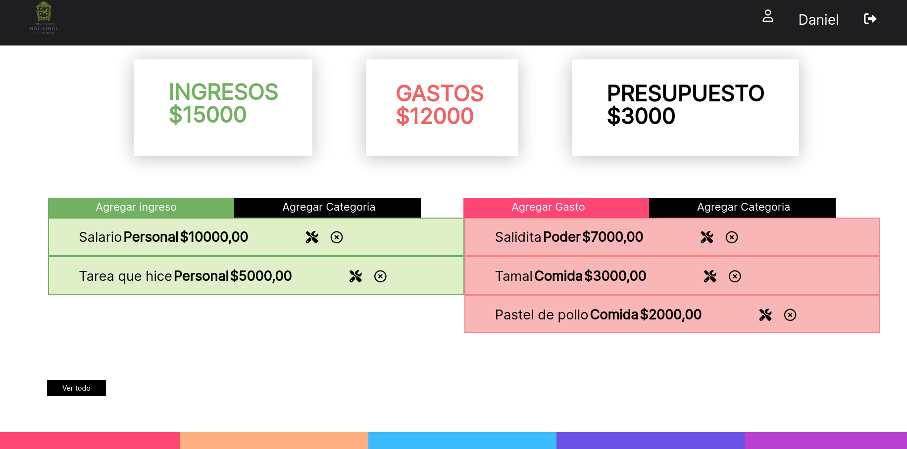
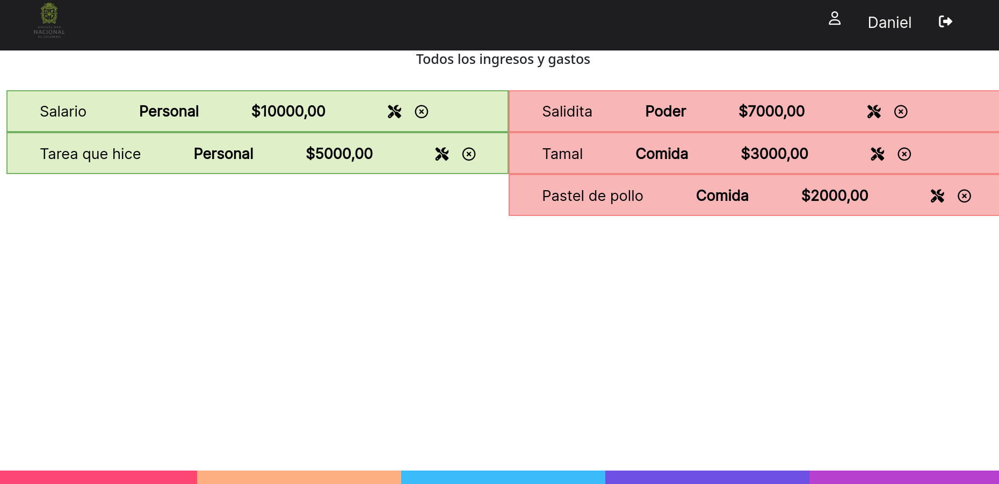
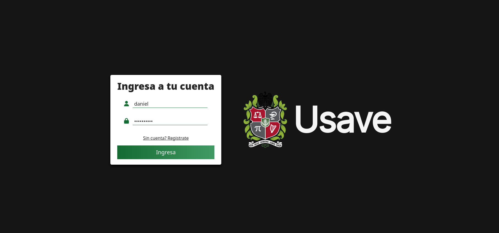

# Spending-tracking-app
Final project for the introduction to systems engineering class.

Dashboard:


List of expenses and income:



Sign in:


To run the project on local do:

```bash
git clone git@github.com:DaniDiazTech/Spending-tracking-app.git
cd Spending-tracking-app
python -m venv .venv
source .venv/bin/activate
pip install -r requirements.txt
python manage.py migrate
python manage.py runserver
```